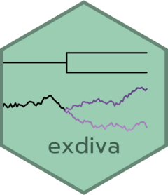

<!-- README.md is generated from README.Rmd. Please edit that file -->

# exdiva 

<!-- badges: start -->

[](https://github.com/almeidasilvaf/exdiva/issues)
[](https://lifecycle.r-lib.org/articles/stages.html#experimental)
[](https://github.com/almeidasilvaf/exdiva/actions/workflows/rworkflows.devel.yml)
[](https://app.codecov.io/gh/almeidasilvaf/exdiva?branch=devel)
<!-- badges: end -->

`exdiva` helps you understand the evolution of gene expression following
gene and genome duplications by providing you with a set of metrics of
gene expression divergence, including:

1.  Spearman correlations between gene pairs;
2.  The $\tau$ index of tissue specificity;
3.  Co-occurrence in coexpression modules;
4.  Dissimilarity between module eigengenes.

## Installation instructions

Get the latest stable `R` release from
[CRAN](http://cran.r-project.org/). Then install `exdiva` from
[Bioconductor](http://bioconductor.org/) using the following code:

``` r
if (!requireNamespace("BiocManager", quietly = TRUE)) {
    install.packages("BiocManager")
}

BiocManager::install("exdiva")
```

And the development version from
[GitHub](https://github.com/almeidasilvaf/exdiva) with:

``` r
BiocManager::install("almeidasilvaf/exdiva")
```

## Citation

Below is the citation output from using `citation('exdiva')` in R.
Please run this yourself to check for any updates on how to cite
**exdiva**.

``` r
print(citation('exdiva'), bibtex = TRUE)
#> To cite package 'exdiva' in publications use:
#> 
#>   Almeida-Silva F, Van de Peer Y (2024). _exdiva: A metric set to
#>   compute expression divergence between gene pairs_. R package version
#>   0.99.0, <https://github.com/almeidasilvaf/exdiva>.
#> 
#> A BibTeX entry for LaTeX users is
#> 
#>   @Manual{,
#>     title = {exdiva: A metric set to compute expression divergence between gene pairs},
#>     author = {Fabrício Almeida-Silva and Yves {Van de Peer}},
#>     year = {2024},
#>     note = {R package version 0.99.0},
#>     url = {https://github.com/almeidasilvaf/exdiva},
#>   }
```

Please note that `exdiva` was only made possible thanks to many other R
and bioinformatics software authors, which are cited either in the
vignettes and/or the paper(s) describing this package.

## Code of Conduct

Please note that the `exdiva` project is released with a [Contributor
Code of Conduct](http://bioconductor.org/about/code-of-conduct/). By
contributing to this project, you agree to abide by its terms.

## Development tools

- Continuous code testing is possible thanks to [GitHub
  actions](https://www.tidyverse.org/blog/2020/04/usethis-1-6-0/)
  through *[usethis](https://CRAN.R-project.org/package=usethis)*,
  *[remotes](https://CRAN.R-project.org/package=remotes)*, and
  *[rcmdcheck](https://CRAN.R-project.org/package=rcmdcheck)* customized
  to use [Bioconductor’s docker
  containers](https://www.bioconductor.org/help/docker/) and
  *[BiocCheck](https://bioconductor.org/packages/3.19/BiocCheck)*.
- Code coverage assessment is possible thanks to
  [codecov](https://codecov.io/gh) and
  *[covr](https://CRAN.R-project.org/package=covr)*.
- The [documentation website](http://almeidasilvaf.github.io/exdiva) is
  automatically updated thanks to
  *[pkgdown](https://CRAN.R-project.org/package=pkgdown)*.
- The documentation is formatted thanks to
  *[devtools](https://CRAN.R-project.org/package=devtools)* and
  *[roxygen2](https://CRAN.R-project.org/package=roxygen2)*.

This package was developed using
*[biocthis](https://bioconductor.org/packages/3.19/biocthis)*.
